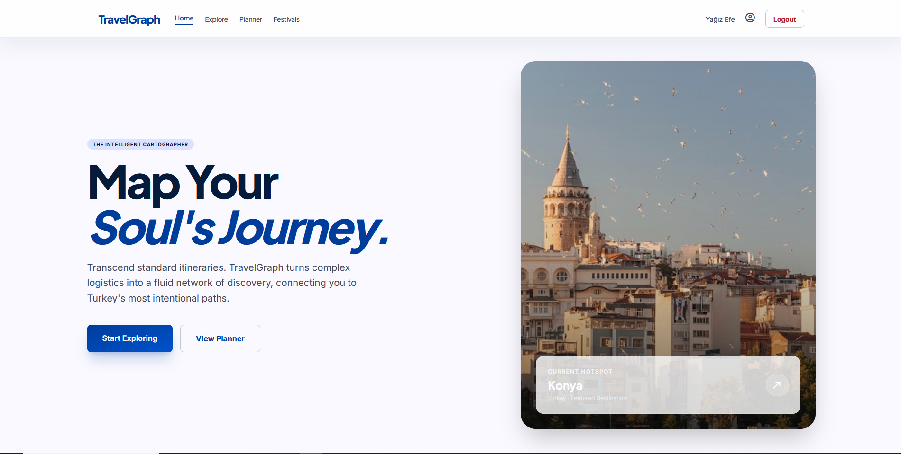
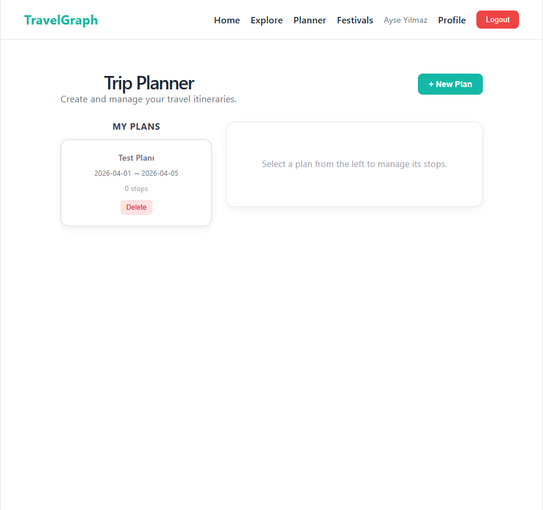
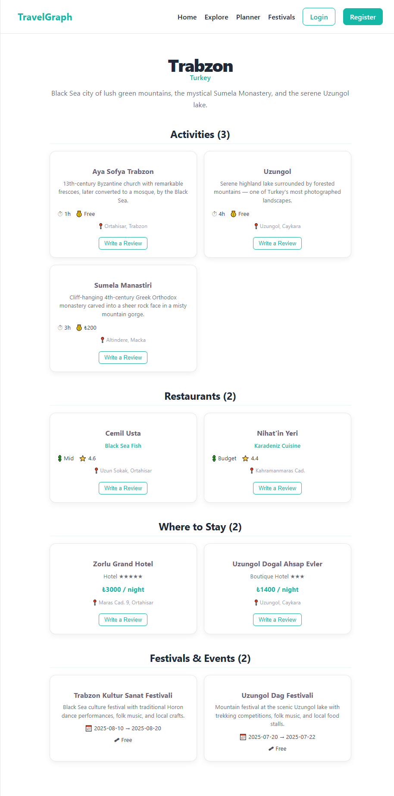
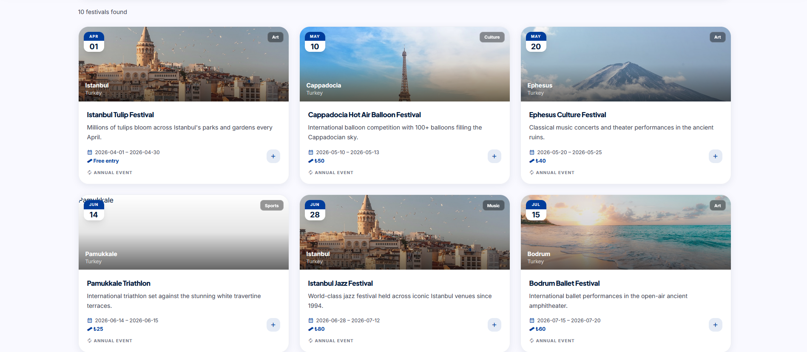
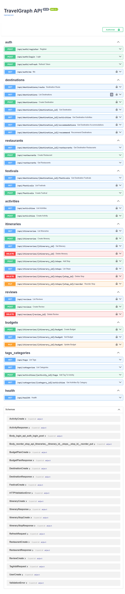

# TravelGraph 🌍

> Graf tabanlı akıllı seyahat rota planlama ve destinasyon keşif platformu.

[](https://fastapi.tiangolo.com)
[](https://react.dev)
[](https://falkordb.com)
[](https://vitejs.dev)

## 📸 Ekran Görüntüleri

| Ana Sayfa | Rota Planlayıcı | Destinasyon Detay |
|-----------|----------------|-------------------|
|  |  |  |

| Bütçe Planlayıcı | Festival Takvimi | API Docs |
|-----------------|-----------------|---------|
|  |  |  |

## ✨ Özellikler

- 🗺️ **Destinasyon Keşfi** — Şehir bilgisi, önemli noktalar, giriş gerektirmez
- 🏨 **Konaklama Önerileri** — Bütçeye göre otel/hostel filtreleme
- 🍽️ **Yemek Önerileri** — Restoran + mutfak türü keşfi
- 🎯 **Aktivite Planlama** — Turistik yerler, özel aktiviteler
- 🎉 **Festival Takvimi** — Tarihe göre etkinlik keşfi
- 💶 **Bütçe Planlayıcı** — Otel / yemek / ulaşım / aktivite kalemleri
- 🔗 **Graf Tabanlı Öneri** — FalkorDB Cypher traversal ile kişisel öneri
- 💬 **Kullanıcı Yorumları** — Giriş yapanlar için opsiyonel

## 🚀 Hızlı Başlangıç

### Gereksinimler
- Python 3.11+
- Node.js 20+
- Docker Desktop

### 1. FalkorDB'yi Başlat
```bash
docker compose up -d
```
FalkorDB UI: http://localhost:3000

### 2. Backend
```bash
cd backend
python -m venv venv
source venv/bin/activate        # Windows: venv\Scripts\activate
pip install -r requirements.txt
cp .env.example .env
uvicorn main:app --reload
```
API: http://localhost:8000  
Swagger Docs: http://localhost:8000/docs

### 3. Seed Verisi Yükle
```bash
cd backend
python -m db.seed
```

### 4. Frontend
```bash
cd frontend
npm install
cp .env.example .env
npm run dev
```
Uygulama: http://localhost:5173

## 🏗️ Mimari

```
TravelGraph
├── backend/                  # FastAPI + FalkorDB
│   ├── routers/              # API endpoint'leri
│   ├── models/               # Pydantic şemaları (14 entity)
│   ├── db/                   # FalkorDB bağlantısı & seed
│   └── services/             # Öneri motoru & Cypher sorguları
└── frontend/                 # React + Vite
    └── src/
        ├── pages/            # 8 sayfa
        ├── components/       # UI bileşenleri
        ├── hooks/            # Custom React hook'lar
        ├── api/              # Axios istek katmanı
        └── contexts/         # Auth state
```

## 🗂️ Varlıklar (14 Entity)

| Entity | Açıklama | İlişki Türü |
|--------|----------|-------------|
| User | Gezgin / üye | — |
| Destination | Şehir & ülke | — |
| Itinerary | Seyahat planı | User'a ait |
| ItineraryStop | Plan ↔ Durak köprüsü | M:N |
| Activity | Turistik yer & özel aktivite | Destination'da |
| Accommodation | Otel / hostel | Destination'da |
| Transport | Uçuş / tren / otobüs | Destination bağlar |
| Restaurant | Restoran + mutfak türü | Destination'da |
| Festival | Etkinlik + tarih aralığı | Destination'da |
| BudgetPlan | Kullanıcı bütçesi + kalemleri | Itinerary'ye ait |
| Review | Yorum & puan (opsiyonel) | User yazar |
| Season | Hava & sezon bilgisi | Destination için |
| Category | Müze, Doğa, Yemek... | M:N Activity ile |
| Tag | Etiket & filtre | M:N Activity ile |

## 🔗 FalkorDB Graf Sorgusu Örneği

```cypher
// Bütçesi 500€, müze seven, Nisan'da gidecek kullanıcıya öneri
MATCH (u:User {id: $user_id})-[:VISITED]->(visited:Destination)
MATCH (d:Destination)<-[:LOCATED_IN]-(a:Activity)-[:IN_CATEGORY]->(c:Category {name: "Museum"})
MATCH (d)<-[:HELD_IN]-(f:Festival)-[:IN_SEASON]->(s:Season {name: "Spring"})
MATCH (d)<-[:LOCATED_IN]-(acc:Accommodation)
WHERE acc.price_per_night * 5 <= $budget * 0.4
  AND NOT (u)-[:VISITED]->(d)
RETURN d.name, count(a) AS museum_count, f.name AS spring_festival
ORDER BY museum_count DESC
LIMIT 5
```

## 👥 Ekip

| İsim | Rol |
|------|-----|
| Yağız Efe Gökçe | Mimar & Backend |
| Berfin Aksoy | Frontend |
| Emirhan Polat | Feature & Dokümantasyon |

## 📄 Lisans

MIT
